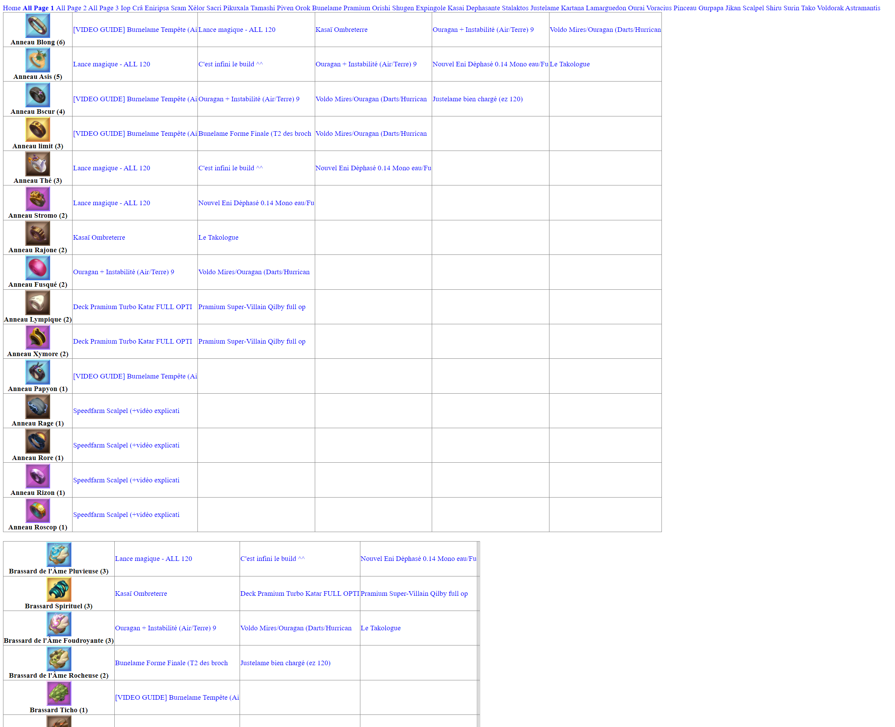

# Description
Waventop is an opensource website used to find which item is valuable based on Wavendb top builds.  
Generate static pages from wavendb.com with most used items.  
Deploy on a public s3 bucket.  




# Usage

```ps1
./start.sh # See available commands and generate .env
# Edit .env file to add AWS credentials
./start.sh infraInit # Create s3 bucket
./start.sh build # create static pages
# ./start.sh infraDestroy # Destroy s3 bucket
```

# TODO
Dockerize all.
